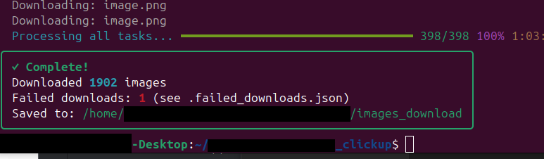

# Download all Images from ClickUp




A powerful Python tool to download all image attachments from your ClickUp workspace with advanced features like resume capability, duplicate detection, and a built-in image sorting interface.

## Features

- **Bulk Download**: Download all images from your entire ClickUp workspace
- **Resume Capability**: Automatically resume interrupted downloads
- **Smart Duplicate Detection**: Skip already downloaded images with file integrity checks
- **Progress Tracking**: Real-time progress bars and detailed statistics
- **Error Handling**: Robust error handling for failed downloads (403, timeouts, etc.)
- **Binary Image Sorter**: Fast keyboard-driven interface to categorize images
- **Auto Organization**: Automatically organize images by ClickUp spaces and lists

## Quick Start

### Prerequisites

- Python 3.7+
- ClickUp API token
- ClickUp Team ID

### Installation

1. Clone the repository:
```bash
git clone https://github.com/yourusername/clickup-image-downloader.git
cd clickup-image-downloader
```

2. Install dependencies:
```bash
pip install -r requirements.txt
```

3. Set up your environment variables:
```bash
cp .env.example .env
# Edit .env with your ClickUp credentials
```

### Getting Your ClickUp Credentials

#### ClickUp API Token
1. Go to your [ClickUp Settings](https://app.clickup.com/settings/apps)
2. Click on **"Apps"** in the left sidebar
3. Click **"Generate"** to create a new API token
4. Copy the token (starts with `pk_`)

#### Team ID
1. Go to your ClickUp workspace
2. Look at the URL: `https://app.clickup.com/{TEAM_ID}/...`
3. The Team ID is the number in the URL after `clickup.com/`

### Configuration

Create a `.env` file in the root directory:
```env
CLICKUP_TOKEN=pk_your_token_here
TEAM_ID=your_team_id_here
```

## Usage

### Download Images

Run the main downloader:
```bash
python clickup_get_images.py
```

The script will:
- Scan your entire ClickUp workspace
- Create organized folders by Space/List structure
- Download all image attachments
- Save metadata for resume capability
- Generate detailed reports

### Sort Images (Optional)

Use the built-in binary sorter to categorize your images:

```bash
cd image_sorter
python image_sorter.py
```

**Keyboard Controls:**
- `1` - Mark as Category A
- `2` - Mark as Category B
- `S` - Skip image
- `Space` - Toggle full-size view
- `Q` - Quit and save progress

### Organize Sorted Images

Copy sorted images into organized folders:
```bash
cd image_sorter
python copy_sorted_images.py
```

## Output Structure

```
images_download/
├── Space Name 1/
│   ├── List Name A/
│   │   ├── image1.jpg
│   │   └── image2.png
│   └── List Name B/
│       └── image3.gif
└── Space Name 2/
    └── List Name C/
        └── image4.webp

sorted_images/          # After sorting
├── category_a/
└── category_b/
```

## Advanced Features

### Resume Downloads
The tool automatically saves progress and can resume from where it left off:
- `.download_metadata.json` - Tracks downloaded files
- `.processed_tasks.json` - Tracks processed ClickUp tasks
- `.failed_downloads.json` - Logs failed downloads

### Error Handling
- **403 Forbidden**: Logs inaccessible URLs and continues
- **Timeouts**: 30-second timeout with retry capability
- **Duplicate Files**: Smart renaming (e.g., `image_001.jpg`)
- **Missing Files**: Detailed error reporting

### Progress Tracking
- Real-time progress bars
- Download statistics
- Processing speed metrics
- Success/failure counts

## File Types Supported

All common image formats:
- JPG/JPEG
- PNG
- GIF
- BMP
- WEBP
- JFIF

## Contributing

1. Fork the repository
2. Create a feature branch
3. Make your changes
4. Submit a pull request

## License

This project is licensed under the MIT License - see the LICENSE file for details.

## Important Notes

- **API Rate Limits**: The tool respects ClickUp's rate limits (≈85 requests/minute)
- **Large Workspaces**: For workspaces with thousands of images, consider running overnight
- **Disk Space**: Ensure sufficient disk space before starting large downloads
- **API Token**: Keep your API token secure and never commit it to version control

## Troubleshooting

### Common Issues

**"403 Forbidden" errors:**
- Check your API token permissions
- Verify team access rights
- Some old attachments may be inaccessible

**"Module not found" errors:**
```bash
pip install -r requirements.txt
```

**Slow downloads:**
- This is normal due to API rate limiting
- Use the resume feature for large downloads

### Getting Help

If you encounter issues:
1. Check the `.failed_downloads.json` file for error details
2. Verify your `.env` configuration
3. Ensure your API token has proper permissions
4. Open an issue with error details

---

**⭐ Star this repo if it helped you organize your ClickUp images!**

## Frequently Asked Questions

### How to automatically download all my images from ClickUp?
Use this tool to bulk download all image attachments from your ClickUp workspace with a single command.

### How to export all images from ClickUp workspace?
This Python script automatically exports and downloads all images from your entire ClickUp workspace, organized by spaces and lists.

### ClickUp bulk image download tool?
Yes, this tool provides bulk download functionality for all ClickUp image attachments with resume capability and error handling.

### How to backup ClickUp images?
Use this tool to create a complete backup of all images in your ClickUp workspace, maintaining the original folder structure.

### ClickUp image extractor Python script?
This is a comprehensive Python script that extracts and downloads all image attachments from ClickUp using the official API.

### How to save all ClickUp attachments?
This tool specifically handles image attachments (JPG, PNG, GIF, etc.) and saves them locally with proper organization.

### ClickUp API download all images?
Uses the official ClickUp API to securely download all image attachments from your workspace with proper authentication.

### How to organize downloaded ClickUp images?
The tool includes a built-in image sorter with keyboard shortcuts to quickly categorize images into different folders.

### ClickUp workspace image migration tool?
Perfect for migrating images when switching platforms or creating backups of your ClickUp workspace content.

### How to sort thousands of images quickly?
Includes a fast binary sorting interface with keyboard shortcuts (1, 2, S, Q) to rapidly categorize large image collections.

### ClickUp image downloader with resume?
Features automatic resume capability - if interrupted, the tool continues from where it left off without re-downloading existing images.

### How to handle ClickUp API rate limits when downloading?
Built-in rate limiting respects ClickUp's API limits (≈85 requests/minute) to ensure stable, reliable downloads.

### Python script to download ClickUp attachments?
Complete Python solution with progress tracking, error handling, and duplicate detection for ClickUp image downloads.

### How to get ClickUp API token for downloading images?
Detailed instructions included for obtaining your ClickUp API token and Team ID from your workspace settings.

### ClickUp image backup automation?
Fully automated solution that scans your entire workspace and downloads all images with minimal user intervention.